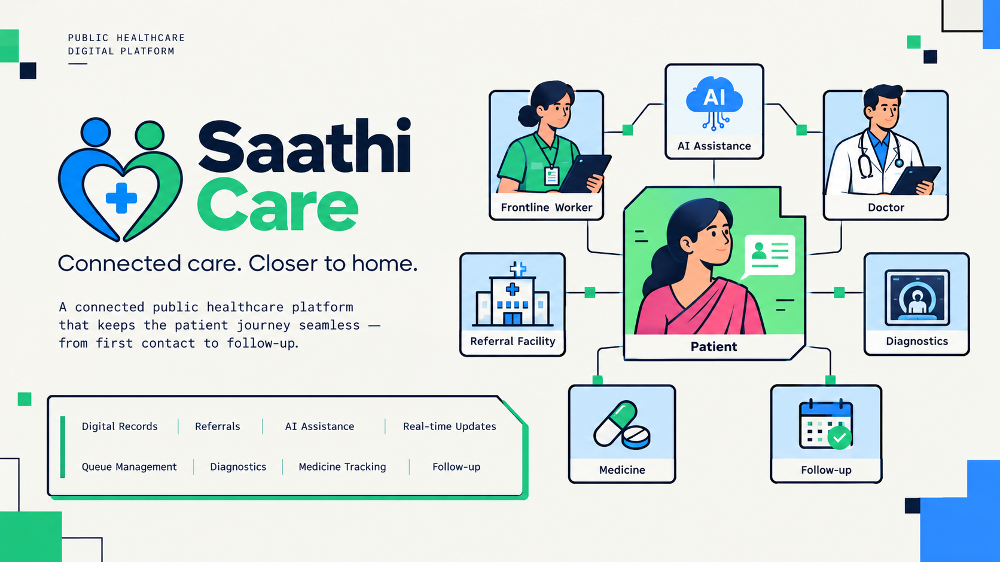
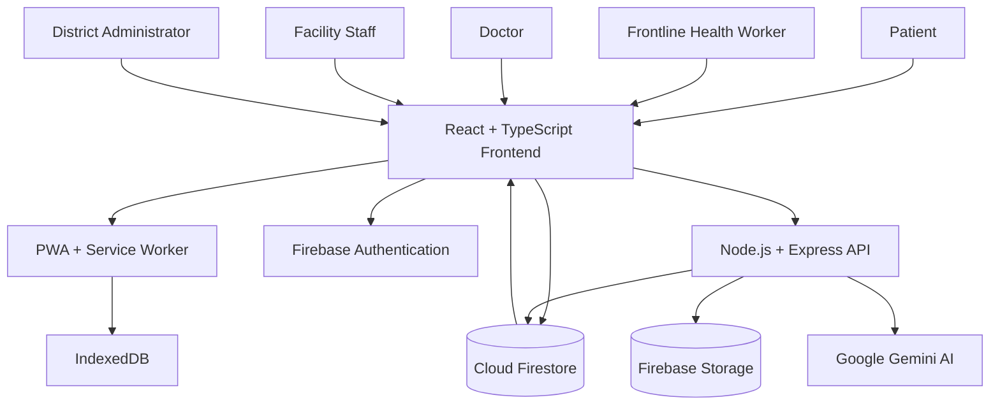
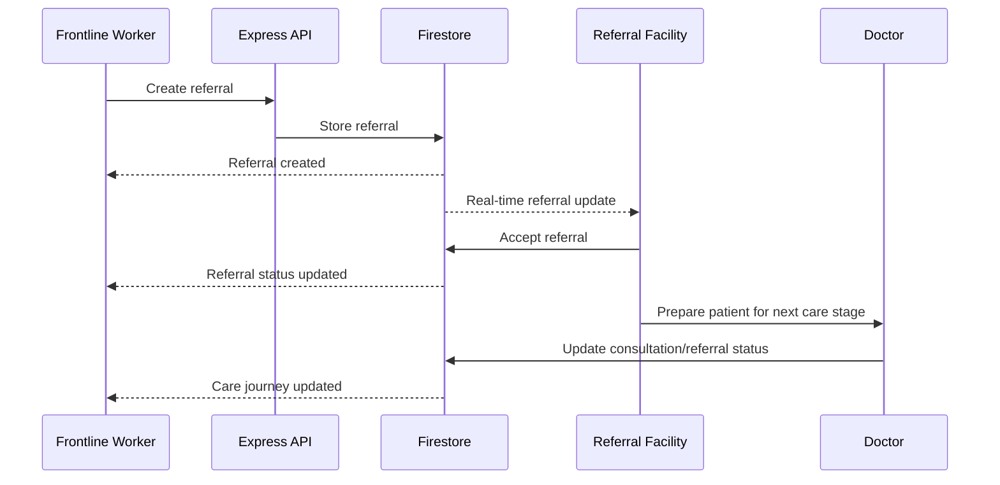
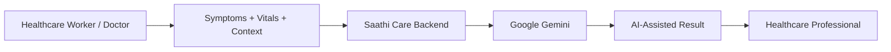
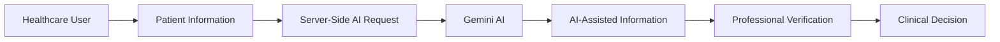
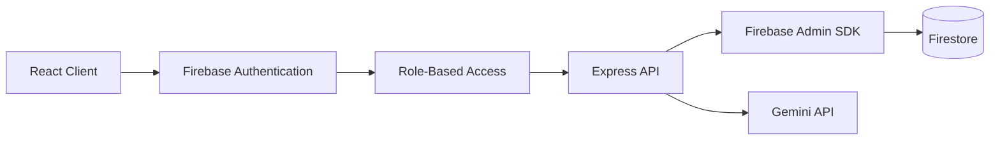
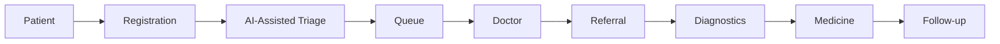
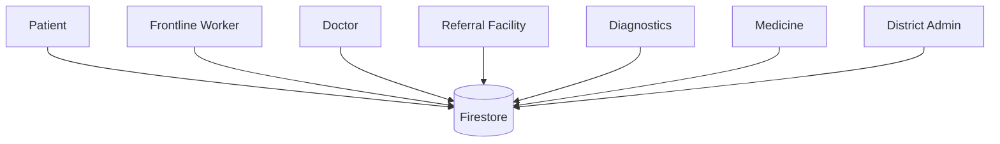

<div align="center">

# Saathi Care — Connected Public Healthcare Platform

### Connected care. Closer to home.

A full-stack public healthcare platform built with **React, TypeScript, Node.js, Express, Firebase, Firestore, PWA technologies, and Google Gemini AI**.

Saathi Care connects patients, frontline health workers, doctors, referral facilities, diagnostics, medicine availability, and follow-up into one continuous healthcare journey.


<br>


</div>

---

# 🚀 Introduction

**Saathi Care** is a connected public healthcare platform designed to improve continuity of care across patients, frontline health workers, doctors, referral facilities, diagnostics, medicines, and follow-up teams.

The core problem is not simply providing another digital healthcare interface.

The challenge is keeping the **patient journey connected after the first healthcare interaction**.

A patient may start at a local health facility, get referred to another facility, undergo diagnostics, receive medicines, and require follow-up.

Without connected coordination, important information and referral status can become fragmented.

Saathi Care addresses this through a continuous digital care journey:

```text
Patient
   ↓
Frontline Health Worker
   ↓
AI-Assisted Triage
   ↓
Doctor Consultation
   ↓
Referral
   ↓
Referral Facility
   ↓
Diagnostics
   ↓
Medicine
   ↓
Follow-up
```

The platform combines:

- React + TypeScript for the frontend
- Node.js + Express for backend APIs
- Firebase Authentication
- Cloud Firestore for real-time data
- Firebase Storage
- Google Gemini for AI-assisted workflows
- PWA + IndexedDB for offline-first workflows
- Real-time Firestore listeners for care coordination

---

# 🎯 Core Problem Solved

Healthcare delivery in rural and underserved communities can become fragmented across multiple facilities and stages of care.

A typical patient journey can look like:

```text
Local Health Centre
       ↓
Doctor Consultation
       ↓
Manual Referral
       ↓
Travel to Another Facility
       ↓
Diagnostic Test
       ↓
Medicine
       ↓
Manual Follow-up
```

The problem is that each stage may operate independently.

Saathi Care converts this into a connected journey:

```text
┌──────────────────────────────────────────────────────┐
│                  SAATHI CARE                         │
├──────────────────────────────────────────────────────┤
│                                                      │
│ Patient                                              │
│    ↓                                                 │
│ Frontline Worker                                     │
│    ↓                                                 │
│ AI-Assisted Triage                                   │
│    ↓                                                 │
│ Doctor                                               │
│    ↓                                                 │
│ Referral ───────────────→ Referral Facility          │
│                              ↓                       │
│                         Diagnostics                  │
│                              ↓                       │
│                           Medicine                   │
│                              ↓                       │
│                          Follow-up                   │
│                                                      │
└──────────────────────────────────────────────────────┘
```

The objective is to keep the patient journey visible and coordinated from **first contact to follow-up**.

---

# ✨ Features

| Feature | Description |
|---|---|
| Frontline Dashboard | Helps frontline health workers register and manage patients |
| Patient Management | Digital patient registration and profile management |
| Longitudinal Health Record | Keeps important patient information and care events connected |
| AI-Assisted Triage | Provides AI-assisted support based on symptoms and recorded vitals |
| AI Summaries | Helps generate structured consultation and referral summaries |
| Multilingual Support | Supports multilingual healthcare workflows |
| Smart Queue Management | Manages patient queues and appointment status |
| Doctor Consultation | Provides doctors with patient history and consultation workflows |
| Real-Time Referral Tracking | Tracks referrals from creation to acceptance and completion |
| Facility Coordination | Connects different healthcare facilities through shared updates |
| Diagnostic Tracking | Tracks diagnostic requests and their progress |
| Medicine Availability | Helps identify available medicines across facilities |
| Follow-up Management | Tracks follow-up activities and reminders |
| Emergency Escalation | Helps flag critical situations for appropriate attention |
| Offline-First PWA | Supports selected workflows during limited connectivity |
| District Analytics | Provides healthcare activity and facility-level visibility |
| Audit Logs | Records important system actions |
| Real-Time Updates | Synchronizes important events through Firestore listeners |
| Role-Based Workflows | Provides different interfaces for different healthcare roles |

---

# 🧠 Continuity of Care

The central design principle of Saathi Care is:

> **A patient's care journey should not end when the patient leaves a healthcare facility.**

The platform therefore connects:

```text
Registration
    ↓
Symptoms
    ↓
Vitals
    ↓
Triage
    ↓
Consultation
    ↓
Referral
    ↓
Diagnostics
    ↓
Medicine
    ↓
Follow-up
```

Each stage contributes to the same care journey instead of becoming an isolated interaction.

---

# 🏗️ Architecture



---

# 🔄 Hybrid Data Architecture

Saathi Care uses a hybrid architecture where the frontend communicates with Firestore for real-time application state while the Express backend handles server-side workflows and protected integrations.

```text
                    React Application
                           │
              ┌────────────┴────────────┐
              │                         │
              ▼                         ▼
        Firestore                    Express
       Real-Time Data                  API
              │                         │
              │                   ┌─────┴─────┐
              │                   │           │
              ▼                   ▼           ▼
        Live UI State         Firebase     Gemini
                              Admin          AI
                                 │
                                 ▼
                              Firestore
```

This architecture allows the application to provide:

- Real-time updates
- Server-side AI integration
- Firebase authentication
- Persistent cloud data
- Backend API workflows
- Offline-first client functionality

---

# ⚡ Real-Time Care Coordination

Real-time synchronization is one of the core capabilities of Saathi Care.

Firestore `onSnapshot()` listeners are used for important modules including:

- Patients
- Queue
- Referrals
- Diagnostics
- Medicines
- Follow-ups
- Health records
- Notifications
- Audit logs

For example:

```text
Frontline Worker
      ↓
Creates Referral
      ↓
Firestore
      ↓
Referral Facility
receives update
      ↓
Accepts Referral
      ↓
Firestore
      ↓
Frontline Dashboard
updates automatically
```

No manual refresh is required for supported real-time workflows.

---

# 🔄 Referral Flow



---

# 🤖 AI-Assisted Workflow

Saathi Care integrates Google Gemini through the backend for AI-assisted healthcare workflows.



AI capabilities include:

```text
Symptoms + Vitals
       ↓
AI-Assisted Triage
       ↓
Structured Information
       ↓
Healthcare Professional
       ↓
Clinical Decision
```

AI is designed as an **assistive layer**.

It does not independently diagnose patients or prescribe treatment.

> **AI-assisted information — verify with a qualified healthcare professional.**

---

# 🛡️ AI Safety Architecture



### Safety principles

- AI is assistive, not autonomous
- Healthcare professionals remain responsible for decisions
- AI API keys remain server-side
- AI outputs are clearly identified
- Patient-facing decisions should be professionally verified
- Demo data is fictional
- Sensitive credentials are stored through environment variables

---

# 📡 Offline-First Architecture

Saathi Care is designed for environments where network connectivity may be unreliable.

```text
User Action
     ↓
Saathi Care PWA
     ↓
IndexedDB
     ↓
Offline Queue
     ↓
Internet Available
     ↓
Synchronization
     ↓
Cloud Backend
```

The offline architecture uses:

- Service Worker
- IndexedDB
- Local synchronization queue
- Progressive Web App architecture

This provides the foundation for continuing selected workflows during temporary connectivity loss.

---

# 🔐 Security Architecture



### Security measures

- Firebase Authentication
- Role-based application workflows
- Protected routes
- Firestore security rules
- Firebase Admin SDK
- Server-side Gemini integration
- Environment-based secrets
- Input validation
- Audit logs
- Consent tracking
- Protected API workflows
- No API keys hardcoded into source code
- Fictional data for demonstration

---

# 👥 User Roles

## Patient

```text
View Care Journey
      ↓
Appointments
      ↓
Referral Status
      ↓
Diagnostics
      ↓
Medicines
      ↓
Follow-up
```

## Frontline Health Worker

- Register patients
- Record symptoms
- Record vitals
- Assist with triage
- Manage queues
- Track referrals
- Support follow-up

## Doctor

- View patient history
- Review vitals
- Conduct consultation
- Review AI-assisted information
- Create referrals
- Track patient care

## Facility Staff

- Receive referrals
- Accept referrals
- Manage diagnostics
- Update medicine availability
- Coordinate facility-level workflows

## District Administrator

- Monitor facilities
- View healthcare analytics
- Monitor referrals
- Track follow-ups
- Review operational indicators

---

# 📁 Project Structure

```text
saathi-care/
│
├── public/
│   ├── icon.svg
│   ├── manifest.json
│   └── sw.js
│
├── src/
│   ├── components/
│   │   ├── common/
│   │   │   ├── CareContinuityBar.tsx
│   │   │   ├── DemoScenarioBanner.tsx
│   │   │   ├── EmergencyModal.tsx
│   │   │   └── SafetyBanner.tsx
│   │   └── layout/
│   │       ├── Navbar.tsx
│   │       └── NavigationTabs.tsx
│   ├── data/
│   │   ├── mockData.ts
│   │   └── translations.ts
│   ├── features/
│   │   ├── analytics/
│   │   │   └── DistrictAnalytics.tsx
│   │   ├── audit/
│   │   │   └── AuditLogViewer.tsx
│   │   ├── demo/
│   │   │   └── DemoControlPanel.tsx
│   │   ├── diagnostics/
│   │   │   └── DiagnosticTracker.tsx
│   │   ├── doctor/
│   │   │   └── DoctorConsultationDesk.tsx
│   │   ├── followup/
│   │   │   └── FollowUpManager.tsx
│   │   ├── frontline/
│   │   │   └── FrontlineDashboard.tsx
│   │   ├── landing/
│   │   │   └── LandingPage.tsx
│   │   ├── medicines/
│   │   │   └── MedicineFinder.tsx
│   │   ├── patient/
│   │   │   └── PatientDashboard.tsx
│   │   ├── queue/
│   │   │   └── QueueManager.tsx
│   │   └── referral/
│   │       └── ReferralTracker.tsx
│   ├── offline/
│   │   ├── db.ts
│   │   └── serviceWorker.ts
│   ├── services/
│   │   ├── aiService.ts
│   │   └── store.tsx
│   ├── types/
│   │   └── index.ts
│   ├── App.tsx
│   ├── index.css
│   └── main.tsx
├── server.ts
├── index.html
├── metadata.json
├── package.json
├── tsconfig.json
├── vite.config.ts
├── .gitignore
└── README.md
```

---

# 🛠️ Tech Stack

## Frontend

   

## Backend

  

## Database & Cloud

   

## AI


## Offline & PWA

  

---

# 🎨 UI / UX Design

Saathi Care follows a **light neo-brutalist healthcare interface** designed to remain clean, accessible, and easy to understand.

### Design characteristics

- Light cream / white foundation
- Bold dark borders
- Blue and green healthcare accents
- Strong typography
- Clear information hierarchy
- Structured dashboard cards
- High-contrast action states
- Responsive layouts
- Accessible interaction patterns
- Clear status indicators
- Patient journey visualization
- Minimal visual complexity for frontline workflows

The design direction combines:

```text
Healthcare
    +
Accessibility
    +
Neo-Brutalism
    +
Modern SaaS
```

---

# 🖥️ Main Screens

## Landing Page

The landing page introduces the platform around one central message:

```text
Healthcare shouldn't depend on how far you live.
```

It communicates:

- The public healthcare problem
- Connected care approach
- Core platform capabilities
- Patient continuity
- AI-assisted workflows

---

## Frontline Dashboard

The frontline dashboard provides tools for:

```text
Patient Registration
       ↓
Symptoms
       ↓
Vitals
       ↓
AI-Assisted Triage
       ↓
Queue
       ↓
Referral
       ↓
Follow-up
```

---

## Doctor Consultation Desk

Doctors can access:

- Patient information
- Previous vitals
- Care history
- Consultation details
- AI-assisted summaries
- Referral workflows

---

## Referral Tracker

The referral system provides visibility into:

```text
Created
   ↓
Sent
   ↓
Accepted
   ↓
In Progress
   ↓
Completed
```

This helps prevent referrals from becoming disconnected from the patient's care journey.

---

# 📸 Screenshots

> Add your final screenshots inside `src/images/` and update the filenames below.


---

# 🔌 API Overview

Saathi Care includes an Express backend for server-side workflows.

## Health

```text
GET /api/health
```

## Patient Management

```text
/api/patients
```

## Queue Management

```text
/api/queue
```

## Consultations

```text
/api/consultations
```

## Referrals

```text
/api/referrals
```

## Appointments

```text
/api/appointments
```

## Diagnostics

```text
/api/diagnostics
```

## Medicines

```text
/api/medicines
```

## Follow-up

```text
/api/followups
```

## Notifications

```text
/api/notifications
```

## Analytics

```text
/api/analytics
```

## AI

```text
/api/ai/triage
/api/ai/translate
/api/ai/referral-summary
```

---

# 🧪 Application Verification

| Workflow | Expected Result |
|---|---|
| Patient Registration | Patient profile created |
| Patient Update | Patient information updated |
| Vitals Entry | Vitals stored |
| AI Triage | AI-assisted result returned |
| Queue Entry | Patient added to queue |
| Doctor Consultation | Consultation recorded |
| Referral Creation | Referral stored |
| Referral Acceptance | Status updated |
| Diagnostic Order | Diagnostic request created |
| Diagnostic Update | Diagnostic status updated |
| Medicine Availability | Facility stock displayed |
| Follow-up Creation | Follow-up activity recorded |
| Notifications | Relevant users receive updates |
| Real-Time Sync | Connected clients receive updates |
| Offline Storage | Selected data stored locally |

---

# ⚡ Real-Time Verification

The real-time workflow can be demonstrated using multiple connected clients.

### Client A

```text
Frontline Dashboard
       ↓
Create Referral
```

### Backend

```text
Firestore Write
       ↓
Firestore Listener
       ↓
Real-Time Event
```

### Client B

```text
Facility Dashboard
       ↓
Referral Appears
       ↓
Accept Referral
```

### Client A

```text
Referral Status
       ↓
Updated Automatically
```

### Result

```text
Client A
   ↓
Firestore
   ↓
Client B
   ↓
Firestore
   ↓
Client A
```

No manual refresh is required for supported real-time workflows.

---

# 🔄 Failure & Recovery

## Temporary Network Loss

```text
User Action
    ↓
Network Unavailable
    ↓
IndexedDB
    ↓
Offline Queue
    ↓
Network Restored
    ↓
Synchronization
```

## AI Service Unavailable

The application can fall back to predefined rule-based assistance for supported workflows when the AI backend is unavailable.

The UI should clearly distinguish:

```text
AI Online
```

from:

```text
Offline / Rule-Based Assistance
```

AI fallback should not be presented as a live Gemini response.

---

# 📱 Progressive Web App

Saathi Care is designed as a Progressive Web App.

### PWA capabilities

- Installable application
- Service Worker
- Offline asset caching
- IndexedDB local storage
- Offline workflow foundation
- Responsive mobile interface
- Desktop and tablet support

---

# 🌍 Deployment

Saathi Care can be deployed as a single web service.

```text
                     Render
                       │
                Saathi Care Server
                       │
          ┌────────────┴────────────┐
          │                         │
     React Frontend            Express API
          │                         │
          └────────────┬────────────┘
                       │
                    Firebase
                       │
             ┌─────────┼─────────┐
             │         │         │
         Firestore    Auth     Storage
```

### Build

```bash
npm install && npm run build
```

### Start

```bash
npm start
```

### Production Environment

```env
VITE_FIREBASE_API_KEY=
VITE_FIREBASE_AUTH_DOMAIN=
VITE_FIREBASE_PROJECT_ID=
VITE_FIREBASE_STORAGE_BUCKET=
VITE_FIREBASE_MESSAGING_SENDER_ID=
VITE_FIREBASE_APP_ID=

FIREBASE_PROJECT_ID=
FIREBASE_CLIENT_EMAIL=
FIREBASE_PRIVATE_KEY=

GEMINI_API_KEY=

NODE_ENV=production
```

> Never commit Firebase Admin credentials or Gemini API keys to GitHub.

---

# 🚀 Getting Started

## Prerequisites

Install:

- Node.js 20+
- npm
- Git
- Firebase project
- Google Gemini API access

## 1. Clone Repository

```bash
git clone https://github.com/dineshit27/saathi-care-sih.git
cd saathi-care-sih
```

## 2. Install Dependencies

```bash
npm install
```

## 3. Configure Environment

Create:

```text
.env
```

Add the required Firebase and Gemini environment variables.

## 4. Start Development Server

```bash
npm run dev
```

## 5. Open Application

```text
http://localhost:3000
```

---

# 🏗️ Production Build

Build the application:

```bash
npm run build
```

Start the production server:

```bash
npm start
```

---

# 🔍 Health Check

```text
/api/health
```

or:

```bash
curl http://localhost:3000/api/health
```

---

# 📊 Engineering Overview

| Area | Implementation |
|---|---|
| Frontend | React + TypeScript |
| Backend | Node.js + Express |
| Database | Firebase Firestore |
| Authentication | Firebase Authentication |
| Storage | Firebase Storage |
| AI | Google Gemini |
| Real-Time | Firestore `onSnapshot()` |
| Offline | Service Worker + IndexedDB |
| API | REST |
| Deployment | Render-ready |
| PWA | Supported |
| Analytics | District-level dashboard |
| Audit | Audit log system |
| Notifications | Real-time notification workflows |

---

# 🧩 Core Firestore Collections

```text
users
patients
healthRecords
vitals
consultations
appointments
queueEntries
referrals
diagnostics
medicines
medicineInventory
facilities
followUps
notifications
auditLogs
emergencyEvents
syncQueue
```

---

# 📈 Care Journey Data Flow



---

# 🏥 Multi-Role Coordination



Firestore acts as the shared real-time data layer connecting supported workflows.

---

# 🎯 Why Saathi Care

### Continuity First

The platform follows the patient beyond the first consultation.

### Built for the Last Mile

PWA and offline-first architecture provide a foundation for low-connectivity environments.

### Human + AI

AI supports healthcare workflows while healthcare professionals remain in control.

### Real-Time Coordination

Queues, referrals, diagnostics, medicines, notifications, and follow-up workflows can be synchronized in real time.

### One Patient Timeline

Important care events can remain connected instead of being scattered across separate systems.

---

# 🌱 Future Scope

Potential future extensions include:

- ABDM integration
- ABHA integration
- FHIR-based interoperability
- Expanded vernacular language support
- Voice-based healthcare assistance
- Teleconsultation integration
- Advanced risk monitoring
- Automated diagnostic coordination
- Government healthcare system integrations
- Large-scale district deployment
- Advanced healthcare analytics

---

# 🧠 AI-Assisted Development

AI tools were used during development as engineering assistance rather than as a replacement for understanding the system.

AI assistance can support:

- UI generation
- Boilerplate development
- Debugging
- Documentation
- Code organization
- Workflow design
- Error analysis
- Architecture iteration
- Prompt engineering
- AI integration

The final platform architecture is centered around:

```text
React
   ↓
Node.js / Express
   ↓
Firebase
   ↓
Firestore
   +
Gemini AI
   +
PWA / IndexedDB
```

---

# 🎥 Demo

The complete demo follows a fictional patient journey:

```text
Patient Registration
        ↓
Symptoms & Vitals
        ↓
AI-Assisted Triage
        ↓
PHC Queue
        ↓
Doctor Consultation
        ↓
Referral
        ↓
Real-Time Referral Acceptance
        ↓
Diagnostics
        ↓
Medicine Availability
        ↓
Follow-up
```

---

# 📚 Resources

<div align="center">

<a href="https://github.com/dineshit27/saathi-care-sih">
  
</a>

<a href="https://saathi-care.onrender.com/">
  
</a>

<a href="https://youtu.be/xsnPkDFPQ0A?si=ehR6mUD_pKuGs_cs">
  
</a>

</div>

---

# 🏆 Smart India Hackathon 2026

**Project:** Saathi Care

**Tagline:** Connected care. Closer to home.

**Category:** Software

**Domain:** MedTech / BioTech / HealthTech

**Focus:** Public Healthcare Accessibility and Quality

---

# 📄 License

This project is intended for educational, hackathon, research, and demonstration purposes.

---

# 👨‍💻 Developer

<div align="center">

## Dinesh M

B.Tech Information Technology  
Software Developer • Full Stack Developer • AI & IoT Enthusiast

<a href="https://github.com/dineshit27">
  
</a>

<a href="https://www.linkedin.com/in/m-dinesh-d30/">
  
</a>

<a href="https://m-dinesh-30.web.app/">
  
</a>

<a href="https://peerlist.io/mr_dineshit">
  
</a>

<a href="https://x.com/mr_dinesh_io">
  
</a>

</div>

---

# ⭐ Support

If you find **Saathi Care** useful or interesting, consider giving the repository a ⭐.

It helps the project gain visibility and supports further development.

---

<div align="center">

### Built with React, Firebase, Node.js, Gemini AI and a lot of debugging.

**Saathi Care | Connected care. Closer to home.**

<br>

Made with care by **Dinesh M**

</div>
